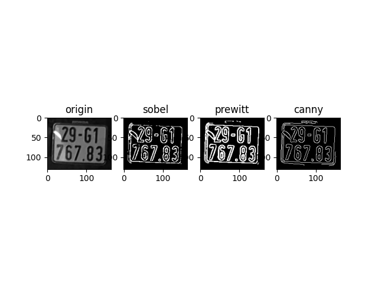
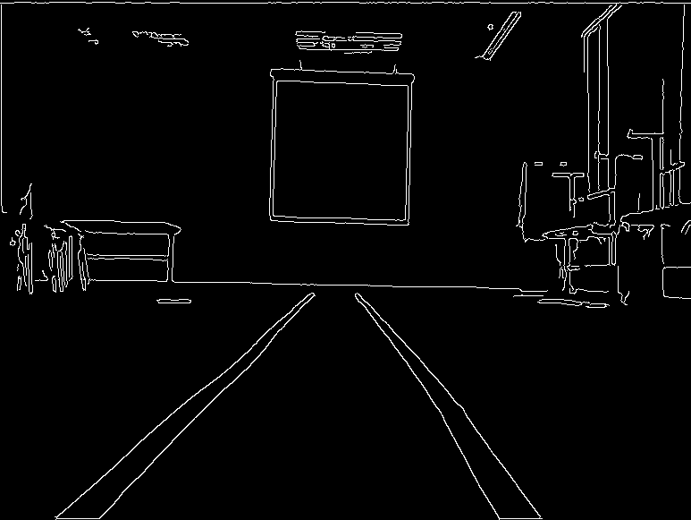
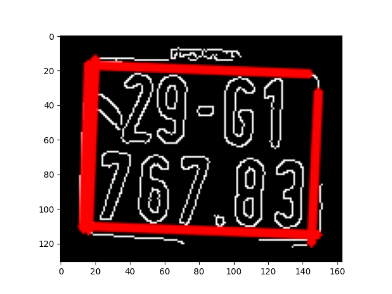

# edge_detection_and_straight-line
Ứng dụng các kĩ thuật phát hiện biên và đường thẳng từ biên với biển số xe , làn đường ,..
Dưới đây là kết quả của tôi.

 
  
  
  
  
  Tôi phát hiện đường thẳng từ các đường biên trong phương pháp canny 
  
  
  

